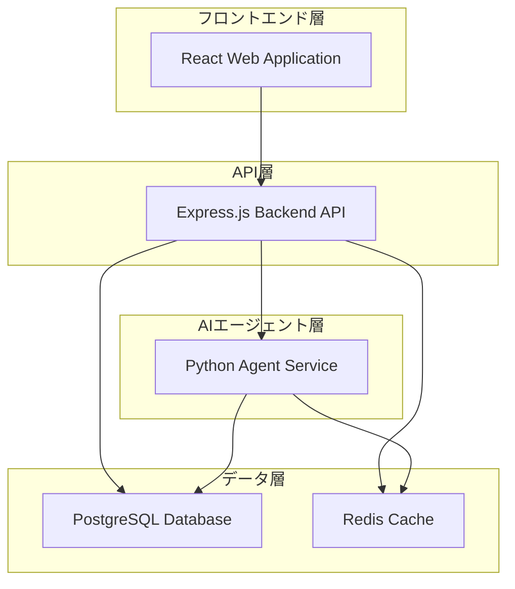

# PromptGym システム構成説明  
  
## 概要  
  
PromptGymは、AIプロンプトエンジニアリングのトレーニングと改善を支援する総合プラットフォームです。複数のAIサブエージェントがオーケストレーターパターンで協調し、ユーザーのプロンプトを分析・改善・ランキングすることで、より効果的なプロンプト作成をサポートします。  
  
## システムアーキテクチャ  
  
### 全体構成  
システムは以下の主要コンポーネントで構成されています：  
  

  
### コンテナ構成  
本システムはcontainerを使用してマイクロサービス化されており、各サービスが独立してスケールできます。  
  
## 主要コンポーネント  
  
### 1. フロントエンド (Web アプリケーション)  
- **技術**: React
- **機能**: ユーザーインターフェース、リアルタイムフィードバック、チームコラボレーション機能  
  
### 2. バックエンド API  
- **技術**: Node.js + Express
- **機能**: RESTful API、ユーザー認証・認可、データベース操作、セッション管理  
  
### 3. AIエージェントサービス  
- **技術**: Python
- **機能**: プロンプト分析・改善・ランキング、複数専門エージェントのオーケストレーション  
  
### 4. データベース層  
- **PostgreSQL**: メインデータベース、ユーザー情報・プロンプト・グループ情報の永続化   
- **Redis**: セッション管理、キャッシング、エージェント間通信 
  
## データアーキテクチャ  
  
### プロジェクト構造  
```  
promptgym/  
  └── apps/  
      ├── web/          # Reactフロントエンド  
      ├── api/          # Express バックエンド  
      └── agent/        # Pythonエージェント  
```   
  
## デプロイメント構成  
  
### 開発環境  
- containerを使用したローカル開発環境  
- ホットリロード対応、実時間でのコード変更反映  
  
### 本番環境  
- **Staging**: 開発用環境 (developブランチ)  
- **Production**: 本番環境 (mainブランチ)   
  
各環境では以下のサービスが自動デプロイされます：  
- API Backend (Node.js/container)  
- Python Agent (Python/container)  
- Web Frontend (React/Vite/container)  
- PostgreSQL Database  
- Redis Cache  
  
## セキュリティ・品質保証  
  
### セキュリティ機能  
- **認証・認可**: 
  - Passport.js による多重認証戦略（Google、GitHub、Microsoft OAuth）
  - セッションベース認証とロールベースアクセス制御
  - グループメンバーシップによる権限管理
- **セッション管理**: 
  - Redis による安全なセッション管理
  - セッション固定化攻撃対策（ログイン時のセッション再生成）
  - セッションCookie設定（HttpOnly、Secure、SameSite）
- **CSRF保護**: 
  - トークンベースCSRF保護（全APIエンドポイント対象）
  - 複数のトークン送信方法に対応
- **パスワードセキュリティ**: 
  - cryptによる強力なパスワードハッシュ化
  - ソルト付きハッシュとタイミング攻撃対策
  - パスワード複雑性要件の強制
- **レート制限**: 
  - ログイン試行回数制限（IP・ユーザー単位）
  - 失敗時の段階的ロックアウト機能
  - API利用量制限
- **入力検証・サニタイゼーション**: 
  - 厳格なスキーマバリデーション
  - 予約語チェックと文字種制限
  - SQLインジェクション対策
- **データプライバシー・ファイルセキュリティ**: 
  - Row Level Securityによる多層アクセス制御
  - プライベートバケット設定とAPI層での所有権チェック
  - 直接ファイルアクセス完全禁止（API経由のみ許可）
  - ファイルサイズ制限（50MB）と同時アップロード数制限
- **環境変数・シークレット管理**: 
  - 本番環境での必須環境変数検証（SESSION_SECRET等）
  - 開発環境と本番環境の適切な分離
  - OAuth設定の動的検証とフォールバック機能
- **監視・ログ・エラー追跡**: 
  - Rollbar による包括的エラー追跡とクラッシュレポート
  - 統一エラーハンドリングによる情報漏洩防止
  - 環境別ログレベル制御（開発：詳細、本番：最小限）
  - ログイン試行記録とIP・ユーザーエージェント追跡
- **セキュリティヘッダー**: 
  - Trust Proxy設定によるプロキシ環境対応
  - AI安全性設定（ハームカテゴリフィルター）  
  
### 品質保証  
- **ユニットテスト**: 
  - フロントエンドの包括的なコンポーネントテスト
  - バックエンドのAPI・ビジネスロジックテスト
  - AIエージェントの非同期処理テスト
  - MSW（Mock Service Worker）によるAPIレスポンスモックに対応
- **E2Eテスト**: 
  - Playwright による実ブラウザでの統合テスト
  - 並列実行対応（3シャード分割）とfail-fast機能
  - セマンティックセレクター使用による堅牢なテスト
- **GitHub Actions CI/CD**: 
  - **コード品質**: Biome による自動フォーマット・リント（自動修正・コミット機能付き）
  - **型安全性**: TypeScript厳格モードによる全ワークスペース型チェック
  - **ビルド検証**: 全アプリケーションのビルド成功確認
  - **Python構文チェック**: ADKエージェントのインポート・設定検証
  - **並列実行**: マトリックス戦略による効率的なテスト実行
- **継続的品質管理**: 
  - 自動品質チェック
  - キャッシュ最適化による高速CI実行
  - 段階的テスト実行（品質→型→ビルド→統合テスト）

## パフォーマンス最適化・スケーラビリティ戦略

プラットフォームには、キャパシティプランニングに重要な高度なパフォーマンス最適化メカニズムが組み込まれています。これには、不正利用を防ぐためのログイン試行やAPIエンドポイントに対するレート制限システム、および多層キャッシュ戦略が含まれます。キャッシュ戦略では、AIエージェントセッション用のRedisベースキャッシュと、グループメンバーシップチェックなどの頻繁にアクセスされるデータ用のインメモリキャッシュの両方を活用しています。

- **レート制限システム**: 
  - ログイン試行の段階的制限とロックアウト機能
  - APIエンドポイント毎の利用量制限
  - IP・ユーザー単位での不正利用防止
- **多層キャッシュ戦略**: 
  - Redisによる分散キャッシュ（AIエージェントセッション、セッション管理）
  - インメモリキャッシュ（グループメンバーシップ、頻繁アクセスデータ）
  - データベースクエリ最適化とコネクションプーリング
- **スケーラビリティ対応**: 
  - マイクロサービスアーキテクチャによる独立スケーリング
  - コンテナ化による水平スケーリング対応
  - 非同期処理によるレスポンス性能向上

## データ管理・事業継続性

システムには、事業継続計画に不可欠なデータバックアップ、災害復旧、データベースメンテナンスの確立された手順が組み込まれています。データベーススキーマのバージョニングとマイグレーション管理は、自動化されたマイグレーションスクリプトを使用して処理され、異なる環境に対応した包括的なデータベースリセットと復元手順を提供しています。

- **データベース管理**: 
  - 自動マイグレーション管理
  - スキーマバージョニングと変更履歴の追跡
  - 環境別データベース設定（開発・ステージング・本番）
- **バックアップ・復旧**: 
  - 定期的なデータベースバックアップ
  - 災害復旧手順とデータ復元プロセス
  - 環境別リセット・復元スクリプト
- **事業継続性**: 
  - システム障害時の迅速な復旧体制
  - データ整合性保証とトランザクション管理
  - 運用監視とアラート体制

## 主な特徴
  
- 🤖 **インテリジェントAIエージェント**: 複数の専門エージェントがプロンプトを多角的に分析
- 📊 **リアルタイムフィードバック**: ストリーミング対応でインタラクティブな体験
- 👥 **グループ**: グループ単位でのユーザー管理が可能
- 📈 **パフォーマンス追跡**: トークン使用量と改善履歴を可視化
- 🔐 **エンタープライズグレードセキュリティ**: JWT認証とロールベースアクセス制御
  
## Notes  
  
- 本システムはモノレポ構成を採用し、複数のアプリケーションが協調して動作するマイクロサービスアーキテクチャです  
- 各コンポーネントは独立してスケール可能で、containerによる統合管理により開発・運用効率を向上させています  
- AIエージェント機能により、従来の静的なプロンプト管理ツールとは異なる、動的で知的なプロンプト改善支援を実現しています
